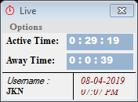
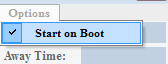

# Live-App

**Want to keep a track of your System's Active & Away Time?**

## Here it comes, the **_Live App_**.

_Features:_
 - Makes Smaller Designs.
 - It shows the System's Active & Away Time of user.
 - It displays the Username, Date & Login Time of user.
 - It also has Translucent effect of 70% fade.

User can tick the "Start on Boot" option, so that it'll automatically opens as if user is logged-in.

FAQ:

1) What’s the accuracy of capturing system time?

A: The Difference between the Actual System Time & Live App Time is just 1 - 5 Second
